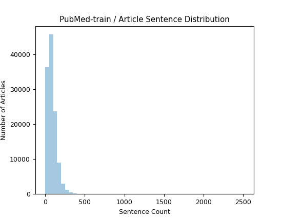

# ArXiv-PubMed-Sum

[process.py](process.py) is a script to process the [ArXiv-PubMed dataset](https://github.com/armancohan/long-summarization). **ArXiv and PubMed** (Cohan et al., 2018) are two long document datasets of scientific publications from [arXiv.org](http://arxiv.org/) (113k) and PubMed (215k). The task is to generate the abstract from the paper body.

## Stats/Visualizations

These visualizations were created by running `python graphs.py <arxiv_articles_dir> <pubmed_articles_dir>`

### ArXiv

| Split Name | Avg Num Sents per Article | Avg Num Sents per Abstract |
|------------|---------------------------|----------------------------|
| Test       | 205.68                    | 5.69                       |
| Train      | 206.38                    | 9.87                       |
| Validation | 204.24                    | 5.60                       |

#### ArXiv Test

 

#### ArXiv Train

 

#### ArXiv Validation

 

### PubMed

| Split Name | Avg Num Sents per Article | Avg Num Sents per Abstract |
|------------|---------------------------|----------------------------|
| Test       | 87.47                     | 6.93                       |
| Train      | 86.22                     | 6.84                       |
| Validation | 87.90                     | 6.84                       |

#### PubMed Test

 

#### PubMed Train

 

#### PubMed Validation

 

## Instructions

The script processes the data into 6 files based on dataset splits. For each of the dataset split files (`train.txt`, `val.txt` and `test.txt`), the articles are read from the arxiv and pubmed sections and written to text files `train.source`, `train.target`, `val.source`, `val.target`, and `test.source` and `test.target`. These will be placed in the newly created `arxiv-pubmed` directory.

The output can be used for [HHousen/TransformerExtSum](https://github.com/HHousen/TransformerExtSum) to perform extractive summarization.

Steps:

1. Download the data from [armancohan/long-summarization](https://github.com/armancohan/long-summarization) or with the following direct links: [PubMed](https://bit.ly/2VsKNvt) ([mirror](https://bit.ly/2VLPJuh)) and [ArXiv](https://bit.ly/2wWeVpp) ([mirror](https://bit.ly/2VPWnzs)).
2. Run the command `python process.py <arxiv_articles_dir> <pubmed_articles_dir>` (runtime: 5-10m).

Commands:

```
pip install gdown
wget https://huggingface.co/HHousen/TransformerSum/resolve/main/arXiv-PubMed/arxiv-dataset.zip
wget https://huggingface.co/HHousen/TransformerSum/resolve/main/arXiv-PubMed/pubmed-dataset.zip
unzip pubmed-dataset.zip
unzip arxiv-dataset.zip
python process.py arxiv-dataset/ pubmed-dataset/
```